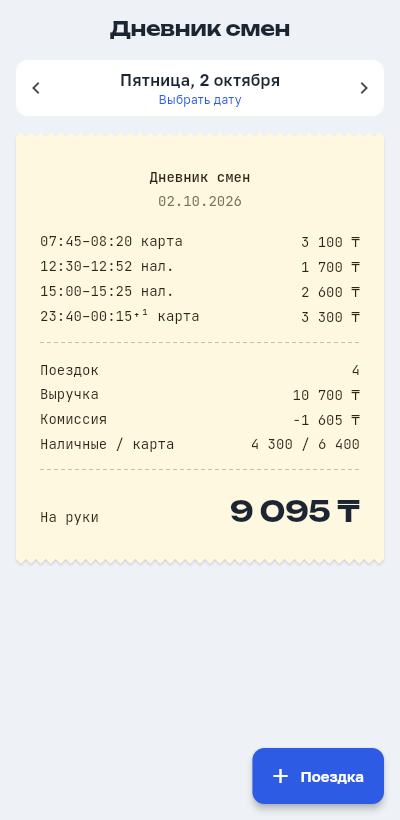
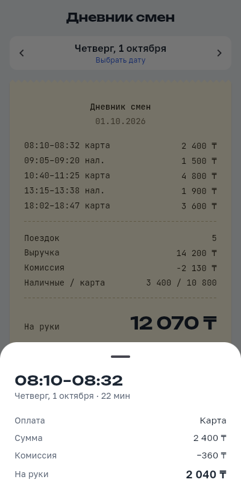
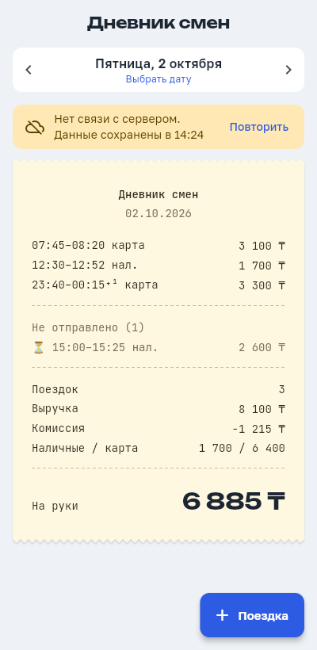
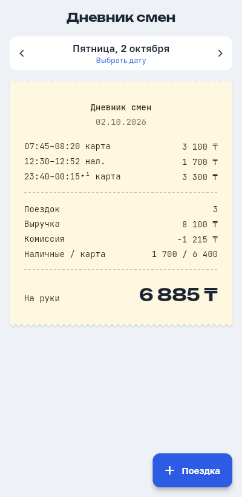
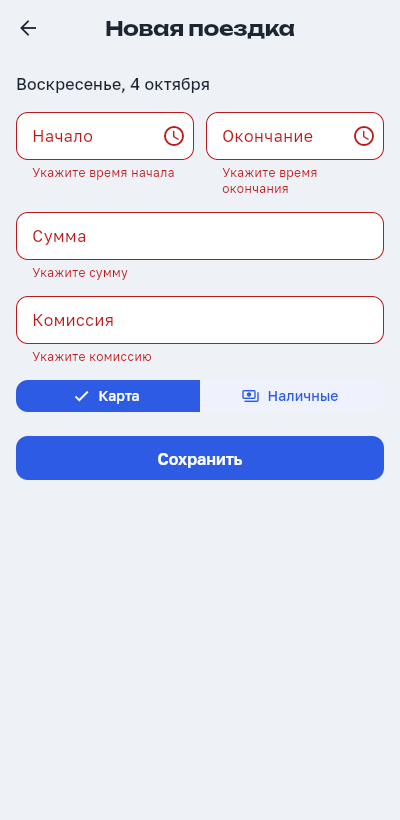
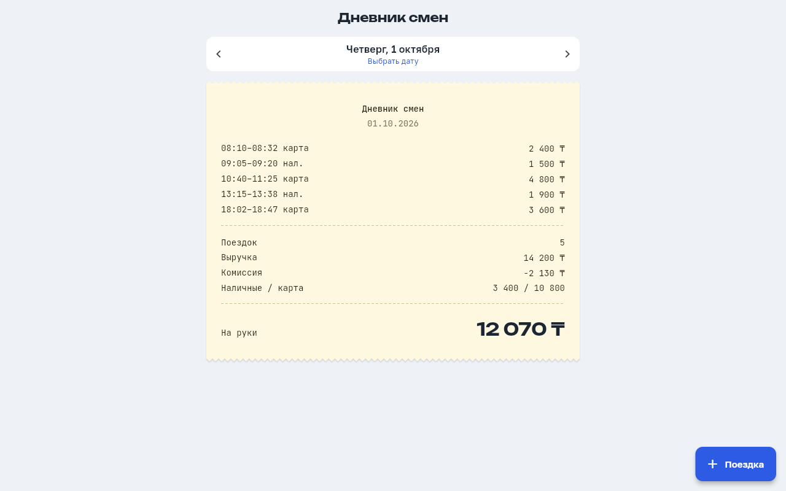

# Дневник смен водителя

Тестовое задание ([текст](docs/TASK.md)). **Сервер** на Dart (shelf) отдаёт поездки и сводку за день и принимает новые поездки с валидацией и защитой от дублей. **Клиент** на Flutter (iOS, Android, macOS, веб) показывает день кассовым чеком, как в макете из задания. Без сети клиент продолжает работать: показывает данные из кэша и копит новые поездки в очереди.

| | |
|---|---|
| **Демо** | https://driver-diary.onrender.com |
| **Репозиторий** | https://github.com/WebDiyar/arqa_flutter |
| **Задание** | [docs/TASK.md](docs/TASK.md) (источник: [jobs.arqa.cc](https://jobs.arqa.cc/#task)) |
| **Ответ для анкеты** | [docs/SUBMISSION.md](docs/SUBMISSION.md) |
| **Резюме** | [cv/Diyar_Amangeldi_Fullstack_Engineer_2026-10.pdf](cv/Diyar_Amangeldi_Fullstack_Engineer_2026-10.pdf) |

> Демо работает на бесплатном хостинге, который усыпляет сервер после 15 минут без запросов. Первое открытие может занять до минуты, приложение об этом предупредит. Поездки, добавленные в демо, сбрасываются при перезапуске сервера, а данные из примера (1–3 октября 2026) остаются.

<p>
  
  
  
</p>

<details>
<summary>Ещё скриншоты: поездка через полночь, ошибки формы, десктоп</summary>

<p>
  
  
</p>

</details>

**Содержание:** [быстрый старт](#быстрый-старт) · [как проверить](#как-проверить-сценарий-для-проверяющего) · [что сделано](#что-сделано) · [защита от дублей](#защита-от-дублей) · [архитектура](#архитектура) · [деплой](#деплой-render-бесплатно) · [ИИ](#как-использовался-ии)

---

## Быстрый старт

### Вариант А: Docker, одна команда

```bash
docker build -t driver-diary . && docker run --rm -p 8080:8080 driver-diary
# → http://localhost:8080  (веб-клиент и API на одном адресе)
```

### Вариант Б: для разработки (macOS)

Нужны **Flutter 3.41+** (в него входит Dart 3.11) и, для iPhone-симулятора и macOS, **Xcode**. Проверка: `flutter doctor`.

```bash
# терминал 1 — сервер на http://localhost:8080
cd server && dart pub get && dart run bin/server.dart

# терминал 2 — клиент
flutter pub get
flutter run -d macos        # или -d chrome, или iPhone: open -a Simulator && flutter run -d iphone
```

В VS Code то же самое запускается одной кнопкой: **F5 → «server + client»**.

Данные в примере за **1–3 октября 2026**: перейди на эти дни стрелками или через календарь. При первом запуске сервер копирует `server/data/seed.json` в `server/data/trips.json`. Чтобы сбросить данные, удали `trips.json`.

<details>
<summary>Android-эмулятор, реальный телефон, переменные окружения</summary>

```bash
flutter run -d emulator-5554                    # клиент сам ходит на 10.0.2.2:8080
flutter run -d <id> --dart-define=API_URL=http://192.168.1.10:8080   # телефон в той же Wi-Fi
```

| Переменная сервера | По умолчанию | Что |
|---|---|---|
| `PORT` | `8080` | порт |
| `DATA_FILE` | `data/trips.json` | файл с поездками |
| `WEB_DIR` | — | если задана, сервер раздаёт ещё и собранный Flutter-веб |
</details>

### Тесты

```bash
cd server && dart test     # 23 теста: сводка, дубли, валидация, HTTP
flutter test               # 31 тест: время/пояса, домен, кэш и офлайн-очередь, экраны, форма
```

---

## Как проверить (сценарий для проверяющего)

Запускать ничего не нужно: открой [демо](https://driver-diary.onrender.com). Подождать до минуты, если сервер спал.

| # | Действие | Что должно быть |
|---|---|---|
| 1 | Открыть приложение | Сегодняшний день, чек «Поездок нет», итоги по нулям |
| 2 | ‹ назад до **1 октября** (или через «Выбрать дату») | 5 поездок; итоги: 14 200 ₸ выручка, −2 130 ₸ комиссия, 3 400 / 10 800 нал/карта, **на руки 12 070 ₸** |
| 3 | Тап по строке поездки | Детали: длительность, сумма, комиссия, на руки за поездку |
| 4 | **2 октября**, поездка `23:40–00:15⁺¹` | Поездка через полночь относится ко дню начала |
| 5 | **3 октября**, поездка `00:30` | Она здесь, а не 2-го, хотя в UTC это ещё 2 октября |
| 6 | «+ Поездка» → «Сохранить» с пустыми полями | Ошибки под каждым полем, запрос не уходит |
| 7 | Ввести сумму 2400 | Комиссия подставилась сама: 360 (15%, как в данных) |
| 8 | Начало 10:00, окончание 09:00 | «На следующий день» → поездка через полночь, это допустимо |
| 9 | Время, которое пересекается с существующей поездкой | Сервер отвечает 409, текст ошибки показан в форме |
| 10 | Корректная поездка → «Сохранить» | «Поездка добавлена», чек и итоги обновились |
| 11 | Выключить сервер (`Ctrl+C`), потянуть чек вниз | Плашка «Нет связи… данные сохранены в HH:MM», чек остаётся на экране |
| 12 | Без сервера добавить поездку | «Сохранена на устройстве», в чеке раздел «Не отправлено (1) ⏳» |
| 13 | Включить сервер → «Повторить» | Поездка ушла на сервер и вошла в итоги, раздел «Не отправлено» исчез |

Защиту от дублей проще проверить через API. Чтение работает и на демо:

```bash
curl https://driver-diary.onrender.com/health
curl 'https://driver-diary.onrender.com/trips/summary?date=2026-10-01'   # на руки 12070
```

Запись лучше пробовать локально (`dart run bin/server.dart` или Docker), чтобы не засорять публичное демо:

```bash
T='{"id":"demo1","start":"2026-10-04T10:00:00+05:00","end":"2026-10-04T10:20:00+05:00","amount":1200,"payment":"cash","commission":180}'
curl -i -X POST localhost:8080/trips -d "$T"     # 201 Created
curl -i -X POST localhost:8080/trips -d "$T"     # 200 OK — та же поездка, дубля нет
curl 'localhost:8080/trips?date=2026-10-04'      # одна поездка
curl -X POST localhost:8080/trips -d '{"start":"2026-10-04T10:00:00+05:00","end":"2026-10-04T09:00:00+05:00","amount":0,"payment":"card","commission":1}'
# 400 {"fields":{"end":"Окончание должно быть позже начала","amount":"Сумма должна быть …", …}}
```

---

## Что сделано

| Требование | Где |
|---|---|
| API: поездки за день | `GET /trips?date=2026-10-01` |
| API: сводка за день (число, выручка, комиссия, на руки, нал/карта) | `GET /trips/summary?date=…`. Расчёт: [server/lib/src/summary.dart](server/lib/src/summary.dart) |
| Клиент: сводка + список, переключение дней | Экран-чек, ‹ › и календарь; день хранится в URL `/day/2026-10-01` |
| Добавление с проверкой (сумма > 0, окончание позже начала) | `POST /trips` → 400 с ошибками по каждому полю; та же проверка в форме до отправки |
| Повторная отправка не создаёт дубль | `POST` идемпотентен → 200 и уже сохранённая поездка ([как](#защита-от-дублей)) |
| Тесты на сводку и дубли | [summary_test.dart](server/test/summary_test.dart), [trip_store_test.dart](server/test/trip_store_test.dart) |

**Сверх задания:**

- **Работа без сети.** Последний отчёт за каждый день сохраняется на устройстве. Без связи клиент показывает его с плашкой «нет связи», а не экран ошибки. Поездка, добавленная офлайн, попадает в очередь и уходит на сервер при следующей загрузке. Повторная отправка безопасна благодаря тому же идемпотентному `id`.
- **Мгновенный экран.** При открытии дня сразу показывается кэш, а свежие данные подгружаются фоном с тонкой полоской прогресса сверху (stale-while-revalidate).
- **Понятная загрузка на бесплатном хостинге.** Если сервер не ответил за 3 секунды, под спиннером появляется пояснение «Сервер просыпается…». Таймаут ответа 70 секунд, чтобы холодный старт не превращался в ошибку.
- **Детали поездки по тапу:** длительность и «на руки» за поездку. Для неотправленной: статус и кнопка «Удалить с устройства».
- **Подсказка комиссии:** 15% от суммы (ставка из данных примера), пока водитель не ввёл комиссию сам.
- **Пересечения по времени** отклоняются (409): водитель не может везти два заказа одновременно.
- **Один Docker-образ** раздаёт и веб, и API, деплой на Render делается в один клик ([render.yaml](render.yaml)).
- **CI:** формат, линтер и тесты обоих проектов на каждый push.

### API

```
GET  /health                          200 {"status":"ok"}
GET  /trips?date=YYYY-MM-DD           200 [Trip]                 по времени начала
GET  /trips/summary?date=YYYY-MM-DD   200 DaySummary
POST /trips                           201 Trip — создана
                                      200 Trip — повтор, дубль не создан
                                      400 {error, message, fields} — валидация
                                      409 {error, message} — конфликт
```

### Защита от дублей

Как работает `POST /trips`:

1. **Ключ идемпотентности — `id`.** Клиент генерирует его один раз при открытии формы, поэтому ретрай после таймаута, двойной тап и отправка из офлайн-очереди приходят с тем же `id`. Если поездка с таким `id` уже сохранена и данные совпадают, сервер отвечает **200** и возвращает её. Если данные другие, это **409**: молча перезаписывать нельзя.
2. **Тот же контент под другим `id`** (или вовсе без `id`) тоже считается дублем: совпадают начало, конец (сравниваются как моменты времени, `08:10+05:00` = `03:10Z`), сумма, способ оплаты и комиссия. Ответ **200**.
3. **Пересечение по времени** с другой поездкой → **409**. Поездки встык (одна кончилась в 08:32, другая началась в 08:32) допустимы.
4. **Гонки.** На сервере добавления идут через очередь: проверка, вставка и запись на диск выполняются строго по одному. Тест отправляет 5 одинаковых запросов параллельно и получает одну запись. На клиенте одновременно идёт не больше одной синхронизации.

### Решения, о которых стоит знать

- **День поездки определяется по часам водителя, а не по UTC.** Поездка `2026-10-03T00:30+05:00` относится к 3 октября. Сервер хранит исходные строки со смещением, а клиент показывает время так, как оно записано, независимо от пояса телефона (`ZonedDateTime`). Поездка через полночь относится ко дню начала и помечается `⁺¹`.
- **Сводку считает только сервер.** Неотправленные поездки видны в чеке отдельным разделом, но в итоги не входят: иначе клиент и сервер разошлись бы в цифрах.
- **Ошибки делятся на временные и окончательные.** Нет сети, таймаут или 5xx означают, что повтор может помочь: поездка остаётся в очереди. Ответы 400 и 409 означают, что сервер отказал осознанно: повтор не поможет, поэтому поездка помечается ошибкой и ждёт решения водителя.
- **Строгая валидация времени.** `DateTime.parse` молча превращает `2026-02-30` в 2 марта, а время без смещения трактует как локальное время сервера. Такие значения отклоняются.
- **Деньги — целые числа** (тенге), без `double`. **Комиссия ≤ суммы**, иначе «на руки» уходит в минус.
- **Хранилище — JSON-файл** (как в задании), запись атомарная: временный файл + rename. Предел у такого решения один процесс сервера. Дальше нужна БД с `UNIQUE(id)`, это помечено в коде.

### Ограничения демо на Render (free)

- Сервис засыпает после 15 минут без запросов, первый запрос после этого идёт 30–60 секунд.
- Файловая система временная: добавленные поездки сбрасываются при перезапуске, а `seed.json` остаётся. Для демо это удобно, у проверяющего всегда чистые данные. Для продакшена нужен Postgres.

---

## Архитектура

```
server/                         Dart + shelf, 4 файла — без слоёв, им там нечего разделять
├── bin/server.dart             запуск, PORT / DATA_FILE / WEB_DIR
└── lib/src/
    ├── trip.dart               модель + валидация, sameAs, overlaps
    ├── summary.dart            расчёт сводки (чистая функция)
    ├── trip_store.dart         хранилище: дубли, пересечения, очередь, атомарная запись
    └── api.dart                маршруты, ошибки → HTTP-коды, CORS

lib/                            Flutter: Feature-first + Clean Architecture
├── app/                        MaterialApp, go_router
├── core/                       сеть, ошибки, время с поясом, хранилище, тема, форматирование
└── features/trips/
    ├── domain/                 Trip, DaySummary, DayReport, PendingTrip; контракт; usecases
    ├── data/                   remote (dio) + local (кэш и очередь), DTO, репозиторий
    ├── presentation/           провайдеры, экраны, чек, детали поездки
    └── di.dart                 связывание слоёв
```

Как данные доходят до экрана:

```
DayPage ─watch─► dayReportProvider(day)  StreamProvider
                   └─► WatchDayReport:  1) кэш с устройства   → экран сразу
                                        2) отправить очередь  → syncPending
                                        3) сервер             → свежий чек (+ в кэш)
                                           нет сети?          → кэш + плашка «нет связи»
```

Подробно, с правилами слоёв и чек-листом новой фичи: [docs/ARCHITECTURE.md](docs/ARCHITECTURE.md).

**Стек клиента:** Riverpod 3, go_router, dio, shared_preferences, intl. Шрифты из макета (Golos Text, JetBrains Mono, Unbounded, лицензия OFL) вшиты в приложение.

---

## Деплой (Render, бесплатно)

1. Запушить репозиторий на GitHub.
2. [render.com](https://render.com) → войти через GitHub → **New → Blueprint** → выбрать репозиторий. Render прочитает [render.yaml](render.yaml) и соберёт [Dockerfile](Dockerfile).
3. Через 5–10 минут сервис доступен по адресу https://driver-diary.onrender.com. Каждый `git push` в `main` запускает автоматический передеплой.

Образ собирается в три стадии: Flutter собирает веб, Dart компилирует сервер в нативный бинарник, а итоговый образ на `scratch` содержит только бинарник, веб и seed (около 30 МБ).

---

## Как использовался ИИ

Код написан вместе с Claude Code. Сначала я ставил задачу и границы (стек, слои, правила дублей, поведение без сети), потом проверял результат тестами, `curl`, запуском в браузере и в macOS-приложении, а офлайн проверял, блокируя запросы в браузере.

Где ИИ ошибся и что пришлось исправить:

- **Синхронный `throw` в `async`-контракте.** `AddTrip.call` возвращал `Future`, но не был `async`, поэтому ошибка валидации вылетала синхронно, мимо обработчиков. Это поймал тест.
- **Кнопка «Удалить» не помещалась.** Нижний лист с деталями по умолчанию не выше 9/16 экрана, и на невысоком экране кнопка обрезалась. Это поймал widget-тест; лист сделан скроллируемым по содержимому.
- **Pull-to-refresh завершался мгновенно.** После перехода на stale-while-revalidate `provider.future` завершался на первом значении, то есть на кэше. Теперь обновление ждёт ответа сервера или ошибки.
- **Шрифты не того формата.** Google Fonts отдавал EOT или WOFF под именем `.ttf`, а Flutter такие не читает. Ошибку нашёл `file`, шрифты сконвертированы через fontTools.
- **Неразрывный пробел.** `intl` разделяет разряды NBSP, поэтому тест с обычным пробелом не находил сумму на экране. Теперь ожидаемая строка строится той же функцией форматирования.
- **Конфликт версий** `intl` с `flutter_localizations`: теперь версию определяет SDK.

---

## Команды

```bash
flutter analyze && flutter test                   # клиент
(cd server && dart analyze && dart test)          # сервер
dart format lib test server                       # форматирование
docker build -t driver-diary .                    # образ для деплоя
```
